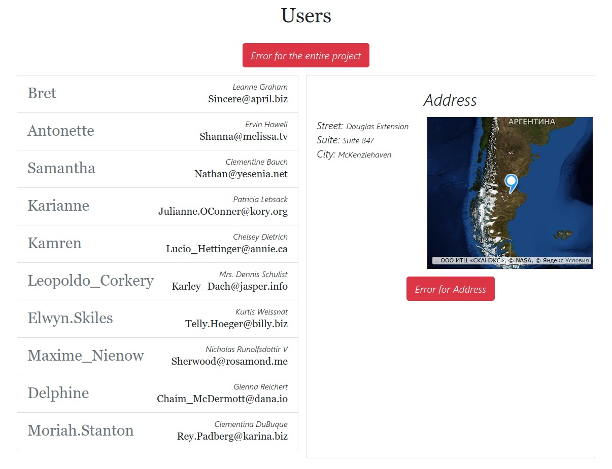

# React TypeScript load data from API

It is simple code example TypeScript in React.js
I don't use Router, Redux or other library, only react and TS.

If you want to start the project, install build configuration [react-create-app](https://github.com/facebook/create-react-app "react-create-app") and run ***npm install*** for install all dependence

To display a map I used the npm package [react-yandex-maps](https://github.com/gribnoysup/react-yandex-maps "react-yandex-maps")

I get data from website http://jsonplaceholder.typicode.com/users

The project is implemented the server error handling and error code.
There's a data download indicator with the API

